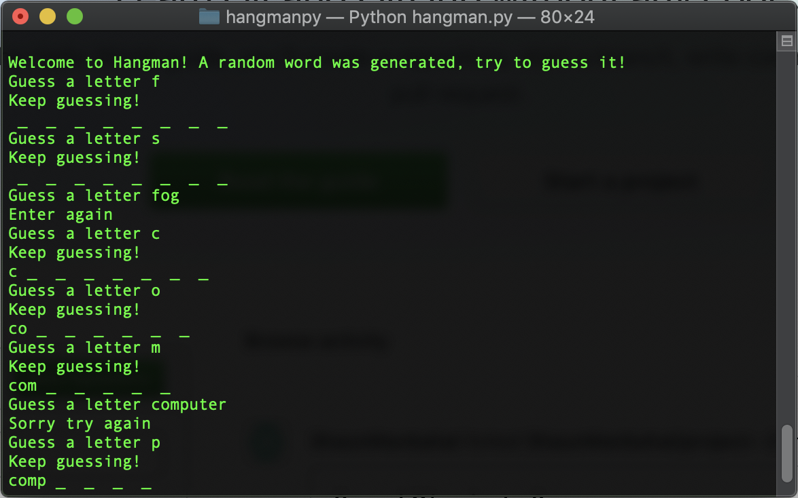

# Hangman.py

## A simple word guess game played on the command line

    

My first attempt at working with python, I decided to make a very simple hangman style game. 

### Software

- **Python3** was used to make the game

### Author
- **Sasank Ganapathiraju**